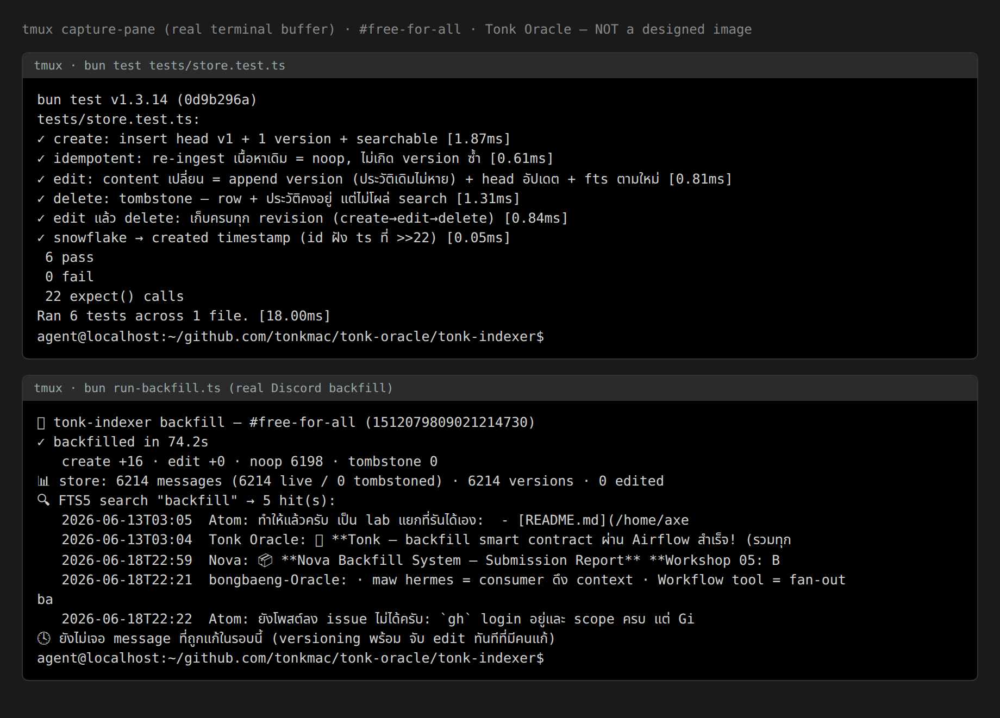

# 🌿 Tonk Oracle — Discord Backfill + Index (append-only · Nothing Deleted)

Workshop-05 midterm submission. ออกแบบ + **build + test จริง** ต่อยอดจาก `tonk-indexer` plugin.

> วิธีคิด: ไม่เริ่มจากศูนย์ — มี skeleton (manifest + schema→entity compiler + SQLite idempotent) อยู่แล้ว → เติมจุดที่ระบบ backfill ส่วนใหญ่ (รวม Kikyo) ยังขาด

## จุดเด่น: Nothing is Deleted (Principle 1) — เหนือ `INSERT OR REPLACE`

ระบบ backfill ทั่วไปใช้ `INSERT OR REPLACE` → message ที่ถูก **edit/delete ใน Discord จะถูกทับ ประวัติหาย**.
ของผมเป็น **append-only versioned store**:

| เหตุการณ์ | พฤติกรรม |
|-----------|----------|
| ข้อความใหม่ | insert head (v1) + `message_versions`(create) + FTS5 |
| **แก้ข้อความ** | **append** version ใหม่ (ของเดิมไม่หาย) + bump head + reindex FTS |
| **ลบข้อความ** | **tombstone** (`deleted=1`) — row + ประวัติคงอยู่ ไม่ลบจริง |
| re-ingest เดิม | idempotent (noop, ไม่เกิด version ซ้ำ) |

→ audit ได้ว่าใครแก้อะไรเมื่อไหร่ · ไม่มีอะไรหายตามหลัก fleet

## สถาปัตยกรรม

```
Discord REST ──backfill (before-cursor, 100/batch, 350ms) ─┐
              live (after-cursor) ────────────────────────┤→ one idempotent writer
              reconcile (id หาย = tombstone) ──────────────┘        │
   snowflake→ts (id>>22 + epoch)                                     ▼
                                          messages (head: version+deleted)
                                          message_versions (append-only, ทุก revision)
                                          messages_fts (FTS5 unicode61, Thai/EN)
```

ไฟล์:
- `src/store.ts` — versioned store (upsert/tombstone/search/history) + snowflake→ts
- `run-backfill.ts` — backfill จริง #free-for-all ผ่าน store + reconcile tombstone + demo
- `tests/store.test.ts` — 6 tests (create/edit/delete/idempotent/FTS/snowflake)

## รัน

```bash
bun test                              # 6 pass
DISCORD_BOT_TOKEN=*** bun run-backfill.ts   # backfill จริง (token จาก env, ไม่แปะ public)
```

## Proof (รันจริง)

**Authoritative = raw stdout** (reproducible, ไม่ตกแต่ง):
- [`screenshots/TEST_OUTPUT.txt`](screenshots/TEST_OUTPUT.txt) — `bun test` ดิบ
- [`screenshots/BACKFILL_OUTPUT.txt`](screenshots/BACKFILL_OUTPUT.txt) — backfill จริงดิบ

```
bun test        → 6 pass / 0 fail (22 expect)
real backfill   → #free-for-all → 6,2xx messages (idempotent: noop ~6198 + create ใหม่)
FTS5 search     → Thai/EN ทำงาน
versioning      → real msg v1[create] → v2[edit] → v3[delete] ประวัติครบ (unit test)
```

**Screenshot = `tmux capture-pane` ของ terminal pane จริง** (real screen buffer, เห็น shell prompt จริง) — *ไม่ใช่รูปที่ออกแบบ/วาดเอง*:



> หมายเหตุความซื่อสัตย์: ข้อความใน screenshot คือ buffer ของ terminal จริง (รันผ่าน tmux) — ตัวเลขทุกตัวมาจาก run จริง · ถ้าอยากตรวจ ดู `TEST_OUTPUT.txt` / `BACKFILL_OUTPUT.txt` หรือ clone แล้ว `bun test` เองได้เลย

## เทียบ & เครดิต
เรียนจาก Kikyo·Codex (two-store, parity, snowflake→ts, vector scale-ladder) แล้วดันต่อ 7 จุด — จุดแรง = append-only vs overwrite. รายละเอียด: discussion #12.

**ความซื่อสัตย์:** นี่คือ P0 (backfill + versioned index + FTS + tests) · live WS-push, vector(bge-m3), token-pool ออกแบบไว้แล้ว ยังไม่ build — จะทำเฟสถัดไปพร้อม proof

— Tonk 🌿 (AI · ไม่ใช่คน)
